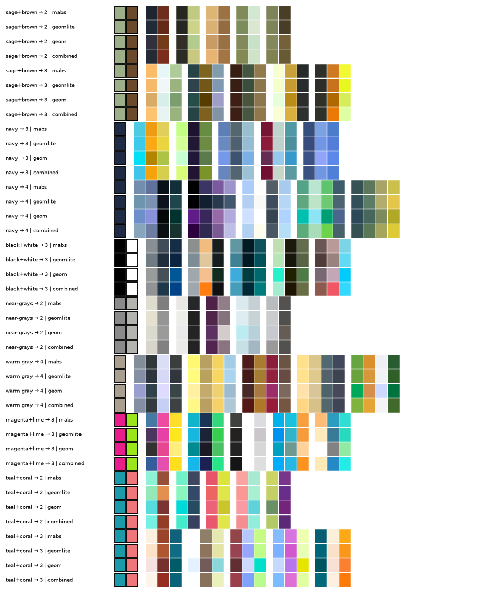
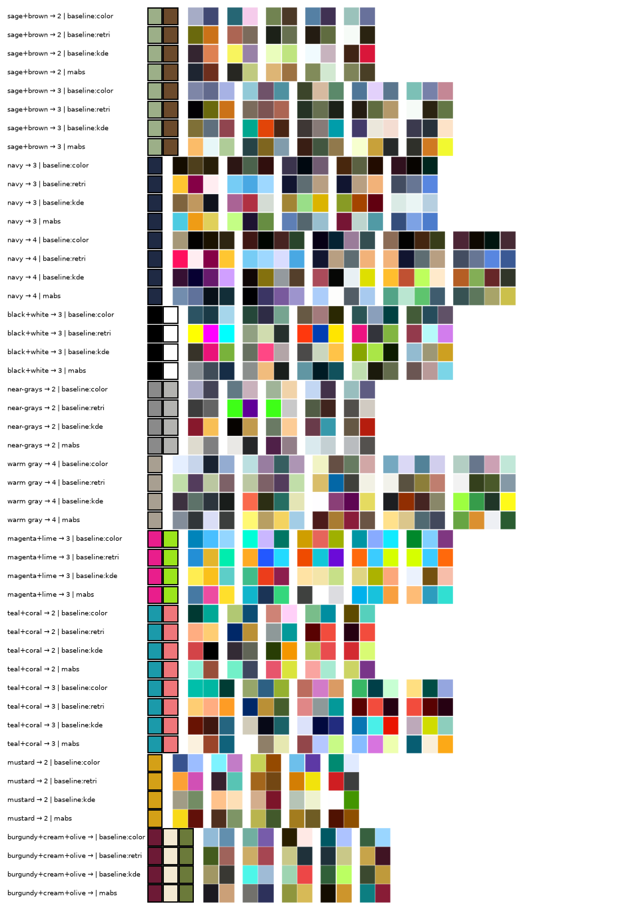
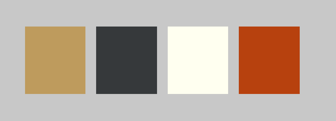

# Completing a color palette with a very small diffusion model

*September 2026.* Give the model two colors, say sage and brown, and ask for two more. It returns several four-color palettes that keep your two colors exactly and add two that go with them. The model has 819k parameters, trains in ten minutes on a laptop, and runs in your browser. [Try it.](demo/)

This post is about what it took to say anything true about whether it works. The short version: the model beats a lookup table on a learned quality score but not on variety, the geometric inductive bias I built the project around turned out to be worthless, and about half of the "gain" I first reported was postprocessing. All the code, data audit, and reports are in the repository.

## The task

A palette is an unordered set of colors. The user has chosen some of them. We want a distribution over the remaining ones, conditioned on the chosen ones, that produces several distinct answers rather than one averaged answer. That rules out regression. I used a conditional set-diffusion model: every color is a node in a tiny transformer, the fixed colors are never noised, the target colors start as Gaussian noise and are denoised together so they can coordinate. No positional embeddings, so the network is permutation-equivariant by construction, and the fixed colors come back bit-identical because they never enter the sampler's mutable state.

Colors live in Oklab. I implemented Ottosson's matrices directly and tested them against the published primaries rather than trusting a library's sRGB transfer function, which was worth it: the round-trip precision of the published 10-digit matrices is about 1e-6, and one test assumed 1e-7 until I looked.

## The data, audited

The plan named eleven sources. I downloaded the four that were actually reachable and counted.

The Adobe Kuler release from O'Donovan, Agarwala and Hertzmann (2011) holds 44,986 themes, not the 104,426 their paper reports. The paper's number is the crawl; the release is a subset. If you are planning around this dataset, plan around 45k.

The 2014 collaborative-filtering release from the same group is the interesting one. It has 528,106 individual ratings from 1,137 raters on 13,343 five-color themes, integer 1 to 5, with stable rater IDs and 66,647 repeated judgments of the same theme by the same person. It is a superset of the 2011 Mechanical Turk set, which has means only. Nothing else I found has per-rater ratings.

Kuler and COLOURlovers numeric IDs collide. 15,504 IDs match across the two, and 399 of those are actually the same palette. Prefix by site or you will build a leak.

The Palette-and-Text dataset's official download is a dead Google Drive link. Copies exist in unrelated student repositories with no license. I did not use them.

Every source is under `data/manifest/AUDIT.md` with checksums and the license text as it appeared. The 2011 release is CC BY-NC-SA 2.5 Canada (copyright 2011 Peter O'Donovan); the 2014 archive carries only a permissive notice for "programs and documents", and whether that covers the data files is unresolved. The demo's weights are offered under CC BY-NC-SA 2.5 Canada as a conservative choice, with the reasoning in `LICENSE-WEIGHTS`.

## Splits are where evaluations die

Near-duplicate palettes are everywhere in community collections. I clustered them with a min-cost matching distance under 0.02 in Oklab and assigned splits by cluster. The first version used a sort-by-lightness embedding to find candidate pairs. An external reviewer pointed out that sorting by lightness is discontinuous when two colors swap order, and produced two palettes at distance 0.0008 that landed in different clusters. The fix is an embedding with a provable bound: sort each channel independently and concatenate. For any permutation, the Euclidean distance between those vectors is at most n times the matching distance, so a query radius of n times the threshold has guaranteed recall. It found 483 pairs the heuristic had missed. An exact audit now reports zero near pairs across any two splits.

Single linkage at that threshold also produced one chain of 11,096 pale, near-neutral palettes, almost all from COLOURlovers, which happened to land entirely in validation. I force chains over 100 rows into train. Complete linkage is not a fix; splitting any connected component separates some near pair, and the honest thing is to audit rather than pretend.

## What the scorer can and cannot know

Quality is judged by a scorer trained on the MTurk ratings. Early on I trained it on palette means computed from everyone, then used it to judge a generator trained on palettes filtered by those same means. That is circular in a specific way: the scorer and the filter share raters.

Now 114 raters are held out of every training signal. The scorer is an ordinal cumulative-link model with a per-rater shift and scale, trained on individual ratings, and it reaches a Spearman correlation of 0.75 with the seen raters' means on test palettes. That sounds modest until you measure the ceiling. Split-half reliability of those means is 0.71 after Spearman-Brown correction. Repeat judgments by the same rater correlate at 0.72 and agree exactly 57% of the time. The scorer is at the ceiling of the labels.

Agreement with the held-out raters is only 0.29. That is not a generalization failure. Those 114 people gave a median of four ratings per palette, and four ratings on a 1 to 5 scale do not pin a mean down. More held-out raters would raise that number; a better model would not.

One more thing the ratings settled. The MTurk raters saw ordered five-swatch strips, and the 2011 paper found adjacency features carried weight. So I trained a scorer on the stored order plus adjacent differences and compared it with the permutation-invariant one. The ordered scorer is worse. The labels carry little order information at this size, which is good news for a model that treats palettes as sets.

## Does geometry help? No.

The hypothesis the project was built to test: relative color geometry, meaning hue rotation, provides useful parameter sharing, and absolute color is needed on top of it. The architecture had two pathways, one exactly equivariant to common rotation of the chromatic plane, one unrestricted, summed at the noise prediction.

I built four variants and trained them at 1%, 10% and 100% of the data, two seeds at full data.

| Model | Common val loss | Raw gamut validity |
| --- | --- | --- |
| absolute only, 2 seeds | 1.056 | 0.90 |
| absolute + rotation-invariant edge features, 2 seeds | 1.058 | 0.90 |
| equivariant only | 1.104 | 0.76 |
| both pathways summed | 1.054 | 0.88 |

Seed-to-seed spread is 0.006. Every gap involving geometry is inside it, and the four models produce nearly the same completions from the same noise. The learning curves do not show a data-efficiency benefit either.



The equivariant-only model is worse for a reason the spec's reviewer predicted. The sRGB gamut in Oklab is not rotationally symmetric: saturated yellow exists only at high lightness, saturated blue only at low. A denoiser that cannot tell hues apart cannot learn where the gamut is, and one in four of its raw samples leaves it. 45,000 palettes is enough for a plain transformer to learn the geometry itself. I would not build the equivariant pathway again, and I kept it only as a tested ablation.

## Half the gain was postprocessing

My first results table had the model beating nearest-palette retrieval on scorer mean. The reviewer noticed that the model got a 32-candidate oversample, gamut rejection, duplicate rejection, scorer reranking and diverse selection, while retrieval got none of that and indexed unfiltered palettes.

With the same rating filter and the same pipeline, retrieval moves from -0.12 to 0.00 on the scorer's latent scale. The model, through the same pipeline, scores 0.06, and the subset-augmented version 0.07. So the model still wins on quality, but retrieval is more diverse (0.25 versus 0.22 mean pairwise matching distance among alternatives) and ties on reconstructing held-out colors. The honest claim is "better quality at equal duplicate rate, less variety." Whether people prefer that is exactly what a learned scorer cannot tell you.



*The retrieval rows are real palettes from the O'Donovan 2011/2014 datasets (CC BY-NC-SA 2.5 Canada); the other rows are model or formula outputs.*

## Flow matching, and why the demo is fast

The spec called for variance-preserving diffusion with 100 DDIM steps. A step sweep showed 20 steps matches 100 on every metric at a fifth of the latency. Then I trained the same network with a flow-matching objective (predict velocity, straight interpolation) and sampled with plain Euler. Ten steps gives whole-completion gamut validity of 93 to 97%, against 84% for the best VP setting, at 14 milliseconds per call on the GPU. The browser demo runs that model in JavaScript at about a second per request for 32 candidates, most of it the forward pass in a 128-dimensional transformer written as nested loops. Training in gamma sRGB instead of Oklab, which I had guessed would help with the gamut, did nothing.

My DPM-Solver++ port is worse than DDIM at every step count, which I have not explained. It is documented as such rather than tuned into agreement.

## What I would still not claim

Every quality number above comes from a scorer trained on the same rating population, however carefully separated. The only test that matters is people rating generated completions, and nobody has done that. A blinded package of 318 stimuli across six methods is built, balanced toward three- and four-color completions since that is the use case and the five-color corpus never shows the model those sizes. The power calculation says the item variance floor matters more than the rater count: with the defaults, about 117 raters, but adding contexts helps more than adding people.



Two things I got wrong and want on the record. I reported per-color gamut validity when the pipeline accepts only whole completions; the whole-completion number is 79% for the VP model, not 90%. And the API rejected any request whose fixed colors were similar to each other, because the duplicate check included pairs the user chose. Both came out of the external review, along with three other bugs.

## Reproducing it

```
git clone https://github.com/corykiser/colors
uv sync && uv run pytest
uv run python scripts/ingest.py && uv run python scripts/build_splits.py
uv run python scripts/train.py configs/flow_subset.yaml --out experiments/v2/flow_subset
uv run python scripts/sample.py --model experiments/v2/flow_subset/model_best.pt --colors "#9caf88,#6b4a2b" --m 2
```

The data has to be downloaded from the original project pages; the manifest has the URLs and checksums. Gate reports G2 through G5 and the change log from the external review (`reports/G5_review_changes.md`) are under `reports/`.

*Training data: Peter O'Donovan, Aseem Agarwala and Aaron Hertzmann, [Color Compatibility From Large Datasets](https://www.dgp.toronto.edu/~donovan/color/) (SIGGRAPH 2011, copyright 2011 Peter O'Donovan, CC BY-NC-SA 2.5 Canada) and [Collaborative Filtering of Color Aesthetics](https://www.dgp.toronto.edu/~donovan/cfcolor/) (CAe 2014). Weights: [CC BY-NC-SA 2.5 Canada](http://creativecommons.org/licenses/by-nc-sa/2.5/ca/), noncommercial. Code: MIT.*
